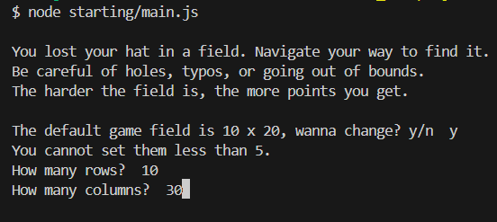
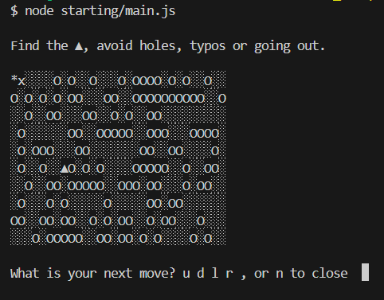
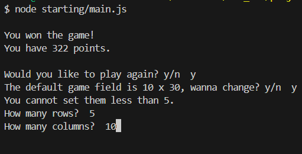

# Field Game

Field Game is a simple console-based game where the player navigates through a field to find a hat ('▲'), while avoiding holes ('O'), and ensuring they don't move out of bounds. The player uses commands to move up, down, left, or right.

## Features

- Randomly generated game field.
- Configurable field size.
- Points system based on the difficulty of the field and path length.
- Option to play multiple rounds.

## How to Play

1. **Starting the Game**: Run the game using Node.js.
2. **Game Objective**: Find the hat ('▲') without falling into holes ('O'), making typos, or moving out of bounds.
3. **Controls**:
   - `u`: Move up
   - `d`: Move down
   - `l`: Move left
   - `r`: Move right
   - `n`: Close the game or a No answer
   - `y`: A Yes answer

## Setup

To set up and run the game, follow these steps:

1. **Install Node.js**: Ensure you have Node.js installed on your machine in a version that support JavaScript ES6.

    ```bash
    node -v
    npm -v
    ```

2. **Install Dependencies**: Install the `prompt-sync` module.

   ```bash
   npm install prompt-sync
   ```

3. **Run the Game**: Execute the game script while you are in the directory containing the `main.js`.

   ```bash
   node main.js
   ```

## Code Overview

### Game Symbols

   - **Hat (`▲`)**: The objective.
   - **Hole (`O`)**: Avoid these to not lose the game.
   - **Field (`░`)**: Normal field cells.
   - **Path (`*`)**: The path you have traveled.
   - **Current Position (`x`)**: Your current location on the field.

### Core Methods and Functions

   - **`FieldGame.startPlay()`**: Starts the game loop and handles the overall game flow. It has two nested helper functions:
     - **`newGame()`** creates a new instance for every game.
     - **`play()`** manages the player's movements during a game.
   
   - **`FieldGame.createFieldArr(rows, columns)`**: Creates and initializes a new random game field with the specified dimensions, ensuring there is a path.
   
   - **`game = new FieldGame(field)`**: Initializes the game field and sets the starting location.
   
   - With each player movement, **`game.changeCurrentLocation(direction)`** changes the player’s location based on the input direction, and **`game.resultOfLocationChange()`** evaluates the result of the move, and **`game.print()`** clears the console and prints the current game field.

### Main Components

   #### 1. Game Field Initialization
   
   - The game field is randomly generated with holes and the hat placed at random locations.
   - The player starts at the top-left corner (`x`).
   
   #### 2. Game Loop
   
   - The game prompts the player for a move until they win, lose, or choose to end the game.
   
   #### 3. User Input Handling
   
   - Validates the player’s input for the directions (`u`, `d`, `l`, `r`).
   
   #### 4. Result Evaluation
   
   - Checks if the player has won by finding the hat, lost by falling into a hole, or gone out of bounds.

### Additional Information

- The difficulty and randomness of the game field can be adjusted by changing the field size and the number of holes.
- The path is generated to ensure there is always a way to reach the hat.

## Screenshots







## License

This project is open source and available under the [MIT License](LICENSE).

Enjoy the game!
